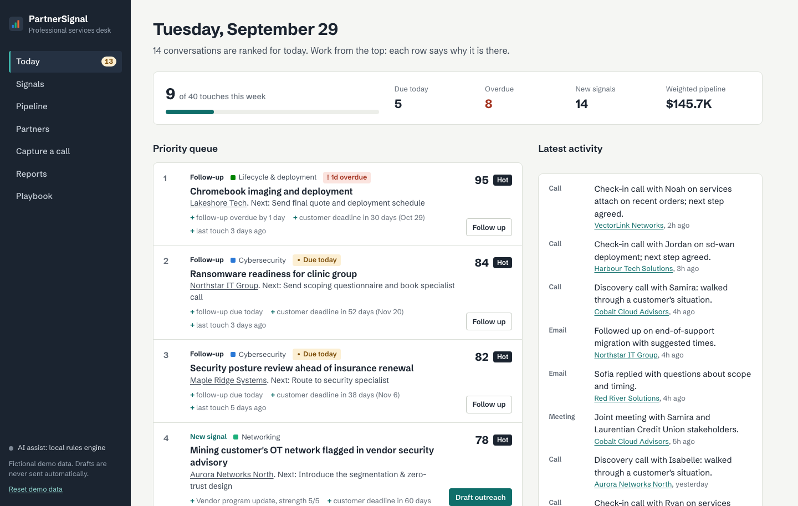
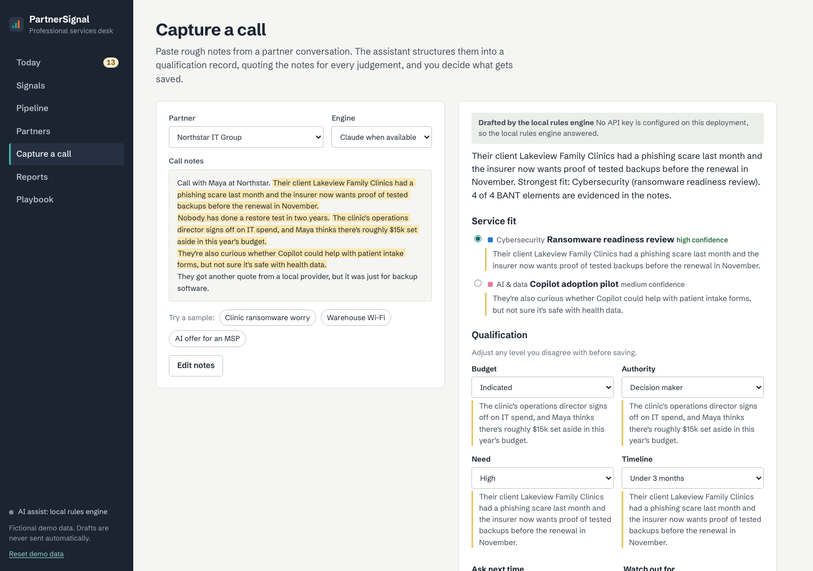

# PartnerSignal

**A partner prospecting, qualification and follow-up workspace for professional-services teams.**

PartnerSignal models the daily work of a professional-services or customer-success associate at an IT
distributor. It finds reseller partners worth calling, turns call notes into a qualified opportunity,
routes the work to the right technical specialist, drafts outreach for a person to review, and keeps
the pipeline honest with follow-up discipline and reporting.

**Live demo:** https://partner-signal-arm6.onrender.com. **Guided tour (2 minutes):** https://partner-signal-arm6.onrender.com/?tour=1



## What it does

| Job to be done | How PartnerSignal handles it |
| --- | --- |
| **Find the right partner to call** | A signal feed built from renewal dates, end-of-support dates, purchase patterns and cloud-marketplace activity, plus a whitespace map showing where a partner sells product but attaches no services. |
| **Understand the customer's problem** | *Capture a call* turns rough notes into a structured record with AI: challenges, likely practice and service, BANT qualification, risks and follow-up questions. Every judgement quotes the notes, highlighted in place. |
| **Qualify before advancing** | BANT (budget, authority, need, timeline) is edited on each opportunity. Stage gates block progress without evidence: *Qualified* needs a documented need plus two more BANT fields; *Solutioning* needs a specialist. |
| **Work with specialists** | Routing suggests the least-loaded specialist in the practice and generates a handoff brief (context, challenge, scope, open questions, ask). |
| **Personalize outreach** | Drafts for four purposes (introduction, discovery follow-up, specialist meeting, re-engagement) explain which record each line came from. The sender edits, ticks a review checklist and sends from their own mail client; PartnerSignal only logs it. |
| **Follow through** | A ranked *Today* queue of overdue follow-ups, stalled deals and fresh signals. Logging any touch resets the next due date from the stage's cadence. |
| **Keep an accurate pipeline** | Kanban board with drag-and-drop stages, weighted pipeline, win/loss reasons, and a CRM-style CSV export. |
| **Learn the portfolio** | A playbook per practice (cybersecurity, cloud and hybrid IT, networking, AI and data, lifecycle and deployment, training): what to listen for, what to ask, what to offer, and AI use cases to raise. |

## Explainable by design

Every ranked item shows a **priority score** (0–100) made of four capped parts, each with written reasons:

| Component | Max | Driven by |
| --- | --- | --- |
| Service fit | 25 | signal strength, the customer's own words, whether the partner has resold this practice before |
| Qualification | 30 | BANT evidence (7.5 points per field) |
| Momentum | 20 | days since the last touch, minus a penalty for stalling in a stage |
| Urgency | 25 | overdue or due follow-ups, customer deadlines within 120 days |

The score ranks which conversation needs attention first. It is not a win probability, and the
interface says so. Full rules are in [docs/METHODOLOGY.md](docs/METHODOLOGY.md).

## AI, with a person in the loop

The AI features use the **Claude API** (Anthropic Python SDK, structured outputs validated by Pydantic)
when an API key is configured. Without a key, or if a call fails or a demo limit is reached, the same
endpoints answer from a deterministic **local rules engine** that returns the same schema. The UI
always says which engine produced a result and why.

Guard rails:

- Prompts restrict the model to evidence in the notes; quotes must be verbatim and missing BANT fields stay *unknown*.
- Extracted fields are shown for review and can be changed before anything is saved.
- Drafts are never sent. Approval requires ticking a review checklist, and edits are recorded.
- Per-visitor and daily limits on live model calls; notes are capped at 6,000 characters.



## Technology

| Layer | Tools |
| --- | --- |
| API | Python 3.12, FastAPI, Pydantic v2, SQLAlchemy 2.0 (SQLite by default; any SQLAlchemy URL) |
| AI | Anthropic Claude API with structured outputs, deterministic fallback engine, rate limiting |
| Front end | React 18, TypeScript, Vite, TanStack Query, React Router |
| Quality | pytest (92% coverage), Vitest and Testing Library, Ruff, mypy, TypeScript strict mode |
| Delivery | Multi-stage Docker build, GitHub Actions (lint, type-check, tests, image smoke test), Render |

## Run locally

```bash
# API
python -m venv .venv
.venv/bin/pip install -e '.[dev]'
.venv/bin/uvicorn partnersignal.main:app --reload        # http://127.0.0.1:8000/docs

# Front end (second terminal)
cd frontend && npm install && npm run dev                 # http://127.0.0.1:5173

# Optional: live Claude drafting
export PARTNERSIGNAL_ANTHROPIC_API_KEY=sk-ant-...
```

Or with Docker: `docker build -t partnersignal . && docker run -p 8000:8000 partnersignal`.

Tests: `.venv/bin/pytest` and `cd frontend && npm test`.

## Project layout

```text
src/partnersignal/
  catalog.py            services, practices, stages, playbooks (single source of truth)
  models.py             partners, signals, opportunities, activities, specialists, drafts
  services/scoring.py   priority score and stage gates
  services/workflow.py  today queue, whitespace, routing, handoff brief, cadence, reports
  ai/                   Claude engine, local engine, shared schemas, engine selection and limits
  api/routes.py         HTTP layer
  seed.py               fictional scenario, dated relative to today
frontend/src/           React app (pages/, components/)
tests/                  API, scoring, AI and seed tests
```

## Data

All partners, people, customers and numbers are fictional and reseeded on start, with dates relative
to the current day so the queue always has something due. *Reset demo data* in the sidebar restores
the scenario at any time.
